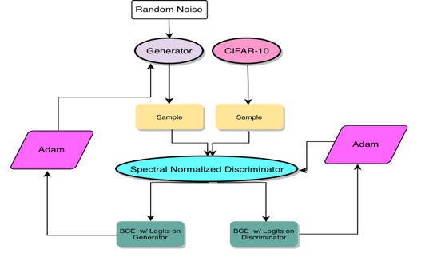
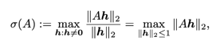
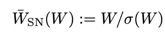
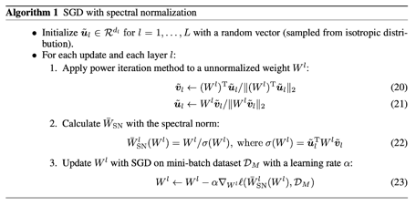
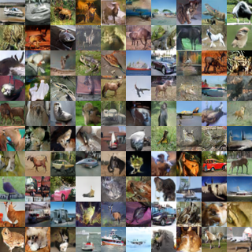

# Spectral Normalization for Generative Adversarial Networks
## https://arxiv.org/pdf/1802.05957.pdf
## EuiYul Song (20214426)

### Files
* ```train.py```: trains spectral gans for 320 epochs (50,000 iterations)
* ```model.py```: contains a generator and spectral normalized discriminator
* ```util/dataset.py```: downloads and preprocesses CIFAR-10
* ```util/generate_fake_image.py```: generates fake images for every 1000 iterations of training
* ```util/generate_inception_score.py```: generates inception score for every 1000 iterations of training
* ```util/inception.py```: creates the Inception model (code borrowed from https://github.com/hvy/chainer-inception-score)
* ```util/inception_model```: pretrained inception model 
* ```util/trainer.py``` training loop implementation of trainer
* ```Makefile```: a command line automation
### Architecture


### Overview
A discriminator of the standard GANs is inaccurate and unstable during training and its derivative can be unbounded and incomputable. Thus, this spectral normalization impose regularization on the space outside of the support of a generator and data distribution. The formulas of the weight normalization through spectral normalization are as follows:



A spectral normalization uses power iteration method and approximation of the spectral norm to estimate σ(W).

### Data
* ```CIFAR-10```: downloads from the chainer library

### Command
* ```make normalize```: preprocess, train, and evaluate the model

### Result

* My spectral normalized GANs (SNGANs) generate fake images accurately and stably. For instance, the images below are the images generated by the SNGANs after trained for 320 epochs (50,000 iterations). Objects depicted in the image are very intuitive that they are easy to categorize with naked eyes.




* **Inception Scores**

α | β1 | β2 | ndis | inception_score |
--- | --- | --- | --- | --- |
0.0002 | 0.5 | 0.9 | 5 | |
### Limitation
* Due to time-constraint to complete this project, I was not able to run my model against the stl-10 dataset nor compare my model with other regularization techniques.